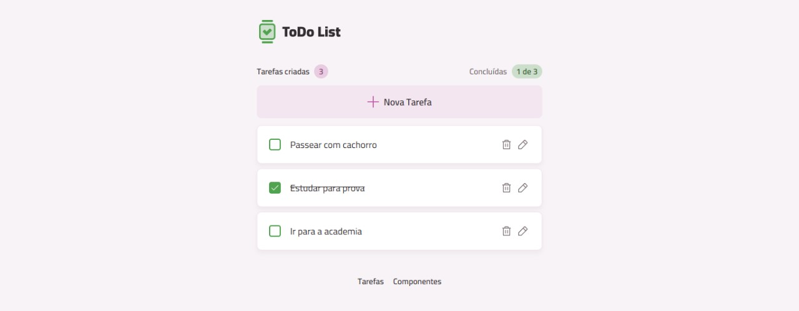

# ToDo List - React & Tailwind CSS



## 📖 Sobre o Projeto

Este é um projeto de uma aplicação de **Lista de Tarefas (ToDo List)** desenvolvido como parte do meu portfólio de front-end. O objetivo foi criar uma interface limpa, intuitiva e responsiva para o gerenciamento de tarefas diárias, utilizando tecnologias modernas e boas práticas de desenvolvimento.

A aplicação permite que o usuário adicione, edite, remova e marque tarefas como concluídas, com todos os dados salvos localmente no navegador.

### ✨ Funcionalidades

-   📝 **Criação de Tarefas:** Adicione novas tarefas à sua lista de forma simples e rápida.
-   ✅ **Marcar como Concluída:** Acompanhe seu progresso marcando tarefas como finalizadas.
-   ✏️ **Edição de Tarefas:** Edite o texto de tarefas existentes (funcionalidade a ser implementada).
-   🗑️ **Remoção de Tarefas:** Exclua tarefas que não são mais necessárias.
-   💾 **Persistência de Dados:** Suas tarefas são salvas no **Local Storage** do navegador, então você não perde seu progresso ao recarregar a página.
-   📊 **Contadores Dinâmicos:** Visualização em tempo real do número de tarefas criadas e concluídas.
-   🎨 **Design Responsivo:** A interface se adapta a diferentes tamanhos de tela.

### 🛠️ Tecnologias Utilizadas

Este projeto foi construído com as seguintes tecnologias e ferramentas:

-   **React:** Biblioteca principal para a construção da interface de usuário.
-   **TypeScript:** Para um código mais seguro, robusto e de fácil manutenção.
-   **Vite:** Ambiente de desenvolvimento extremamente rápido e moderno.
-   **Tailwind CSS:** Framework de estilização para um design ágil, customizável e responsivo.
-   **Class Variance Authority (CVA):** Para criar componentes com variantes de estilo de forma organizada.
-   **React Router:** Para o gerenciamento de rotas da aplicação.
-   **use-local-storage:** Hook customizado para persistir o estado no Local Storage do navegador.
-   **Biome:** Ferramenta para formatação e linting do código, garantindo consistência.
-   **Vite-plugin-svgr:** Para importar arquivos SVG como componentes React.

### 🚀 Como Executar o Projeto

Para rodar este projeto localmente, siga os passos abaixo:

**Pré-requisitos:**
-   [Node.js](https://nodejs.org/en/) (versão 18 ou superior)
-   [Git](https://git-scm.com/)
-   Um gerenciador de pacotes (npm, yarn ou pnpm)

```bash
# 1. Clone o repositório
git clone [https://github.com/seu-usuario/seu-repositorio.git](https://github.com/seu-usuario/seu-repositorio.git)

# 2. Acesse a pasta do projeto
cd seu-repositorio

# 3. Instale as dependências
npm install

# 4. Execute a aplicação em modo de desenvolvimento
npm run dev
```

Após executar o último comando, abra `http://localhost:5173` (ou a porta indicada no seu terminal) no seu navegador para ver a aplicação.

### 📄 Licença

Este projeto está sob a licença MIT. Veja o arquivo [LICENSE](LICENSE) para mais detalhes
